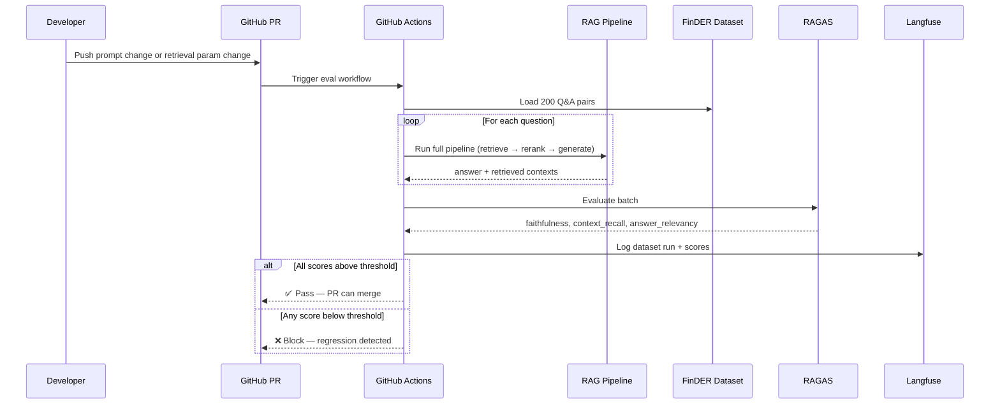
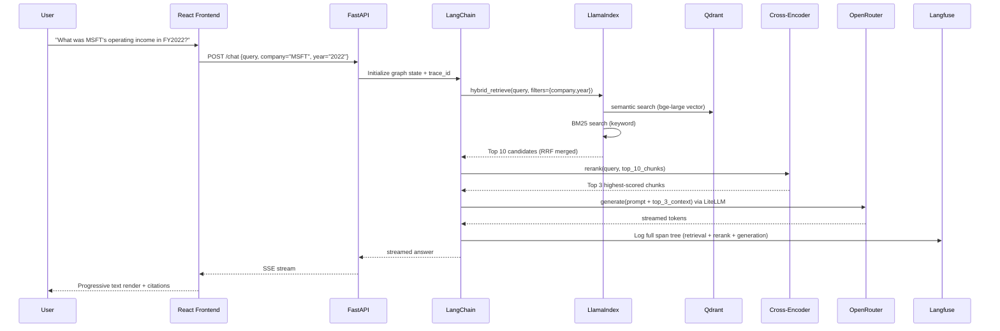

# AI Financial Knowledge Assistant — Technical Plan

> A production-grade RAG system with semantic document parsing, hybrid retrieval,
> cross-encoder reranking, LLMOps observability, and automated regression evals,
> built for financial document Q&A.

---

## 1. Project Overview

This system answers natural language questions over a corpus of real financial documents
(10-Ks, 10-Qs, earnings reports). It goes beyond a basic chatbot by implementing a full
LLMOps pipeline — every answer is traced, every prompt change is regression-tested, and
performance metrics are surfaced in a live dashboard.

The architecture is split across two frameworks with distinct responsibilities:

- **LlamaIndex** owns the **data plane** — everything touching documents
- **LangChain** owns the **control plane** — orchestration, chaining, and reasoning flow

---

## 2. Full System Architecture

```mermaid
flowchart TD
    U([User / React Dashboard]) --> API

    subgraph Control Plane — LangChain
        API[FastAPI\nStreaming SSE] --> RN[Retrieval Chain]
        RN --> CE[Cross-Encoder\nReranking Step]
        CE --> GEN[Generation Chain]
        GEN --> TN[Trace Step\nLangfuse]
        TN --> API
    end

    subgraph Data Plane — LlamaIndex
        RN --> BM25[BM25\nLexical Index]
        RN --> QD[Qdrant\nSemantic Index]
        BM25 --> RRF[RRF Merger\nTop 10 candidates]
        QD --> RRF
        RRF --> CE
    end

    subgraph Ingestion Pipeline
        DOC[FinanceBench PDFs] --> DL[Docling\nStructure-Aware Parsing]
        DL --> SSP[SemanticSplitterNodeParser\nEmbedding-Based Chunking]
        SSP --> QD
        SSP --> BM25
    end

    subgraph LLM Layer
        GEN --> LM[LiteLLM]
        LM --> OR[OpenRouter API\nMistral / Gemma]
    end

    subgraph Embeddings
        QD --> EMB[bge-large-en-v1.5\nLocal — query + ingestion]
        CE --> CEM[cross-encoder/ms-marco-MiniLM-L-6-v2\nLocal — reranking only]
    end

    subgraph Observability
        TN --> LF[Langfuse\nTracing + Scores]
        LF --> RD[React Dashboard\nMetrics + Evals]
    end

    subgraph Eval Pipeline — CI
        GHA[GitHub Actions\nOn PR] --> RAGAS[RAGAS Eval Runner]
        RAGAS --> FD[FinDER Dataset\nHuggingFace]
        RAGAS --> LF
    end
```

---

## 3. Datasets

### 3.1 Ingestion Corpus — FinanceBench
**Source:** `github.com/patronus-ai/financebench`

This is your knowledge base. It contains ~150 real financial PDFs across major public
companies — 10-K annual reports, 10-Q quarterly reports, and earnings releases. These
are the documents your RAG system will parse, chunk, index, and answer questions over.

Each document is tagged with metadata at ingestion time:

| Metadata Field | Example Value | Purpose |
|---|---|---|
| `company` | `AAPL`, `MSFT`, `AMZN` | Payload filter in retrieval |
| `year` | `2022`, `2023` | Payload filter in retrieval |
| `doc_type` | `10K`, `10Q` | Filter by report type |
| `page_number` | `14` | Source citation in answer |
| `element_type` | `table`, `paragraph`, `header` | Structural context from Docling |
| `source_file` | `AAPL_2022_10K.pdf` | Trace attribution |

### 3.2 Evaluation Set — FinDER
**Source:** `huggingface.co/datasets/Linq-AI-Research/FinDER`

This is your regression benchmark. FinDER provides curated financial Q&A pairs with
ground-truth answers. You run 200 questions from this dataset through your pipeline on
every pull request that changes a prompt or retrieval parameter. If any RAGAS metric
drops below threshold, the PR is blocked.

---

## 4. Technology Stack

### 4.1 Package & Environment Management

| Tool | Role |
|---|---|
| `uv` | Python package manager — replaces pip/poetry. Fast, lockfile-based. |
| `Docker + Compose` | Runs all services (backend, Qdrant, Langfuse, frontend) in a unified environment |

### 4.2 Data Plane — LlamaIndex

Everything that touches documents lives here.

| Component | Tool | Detail |
|---|---|---|
| Document parsing | `Docling` (IBM, Apache 2.0) | Structure-aware PDF parsing — extracts tables, headers, footnotes as distinct typed elements with full layout context |
| Semantic chunking | `SemanticSplitterNodeParser` | LlamaIndex splitter that uses embedding similarity to detect natural topic boundaries instead of fixed token windows |
| Bi-encoder embeddings | `BAAI/bge-large-en-v1.5` | Local model, ~1.3GB, used for both ingestion and query vectorisation |
| Cross-encoder reranker | `cross-encoder/ms-marco-MiniLM-L-6-v2` | Local model, ~85MB, scores (query, chunk) pairs jointly — significantly more accurate than bi-encoder similarity alone |
| Semantic index | `LlamaIndex QdrantVectorStore` | Stores vectors + metadata in Qdrant |
| Lexical index | `LlamaIndex BM25Retriever` | Keyword-based index, persisted to disk |
| Hybrid merger | `QueryFusionRetriever (RRF)` | Reciprocal Rank Fusion of BM25 + semantic results → top 10 candidates |
| Payload filtering | `MetadataFilters` | Filter by company/year before retrieval |
| Eval metrics | `RAGAS` | Faithfulness, context recall, answer relevancy |

### 4.3 Control Plane — LangChain

Everything about orchestration and flow lives here.

| Component | Tool | Detail |
|---|---|---|
| Pipeline chain | `LangChain LCEL` | Composable chain syntax — each step is a Runnable, piped together with `\|` operator |
| Retrieval step | Calls LlamaIndex hybrid retriever | Passes filters from user query, returns top 10 candidates via RRF |
| Reranking step | Calls cross-encoder locally | Scores all 10 (query, chunk) pairs, returns top 3 to generation |
| Generation step | Calls LiteLLM → OpenRouter | Builds final prompt from reranked top 3, streams response |
| Trace step | Calls Langfuse SDK | Logs full span tree per request including reranker scores |

### 4.4 LLM Layer

| Tool | Role |
|---|---|
| `LiteLLM` | Unified interface to OpenRouter — single client for all model calls |
| `OpenRouter` | API gateway — your $10 credit, model-agnostic |
| Recommended model | `mistralai/mistral-7b-instruct` | Cheap, fast, strong instruction following |
| Fallback model | `google/gemma-7b-it` | Useful if Mistral quota is exhausted |

All LLM calls go through LiteLLM to OpenRouter. This means you can swap models without
changing any code.

### 4.5 Vector Database — Qdrant

Qdrant holds your embedded document chunks alongside their metadata. Two things make it
the right choice here:

- **Payload filters** — Filter by `{company: "AAPL", year: "2022"}` at query time,
  narrowing retrieval scope before semantic search runs.
- **Hybrid search support** — Works natively with LlamaIndex's `QueryFusionRetriever`.

Runs as a Docker container locally; Qdrant Cloud free tier (1GB) in production.

#### Collection Setup

The collection is created via an idempotent setup script before ingestion:

```bash
cd backend
uv run python ingestion/setup_collection.py
```

Safe to re-run — skips creation if the collection already exists, then re-ensures all
payload indexes.

**Collection configuration (`finlens_chunks_dev` by default, override with `QDRANT_COLLECTION` env var):**

| Setting | Value | Reason |
|---|---|---|
| Vector name | `dense` | Named vector dict — required for multi-vector collections |
| Dimension | `1024` | bge-large-en-v1.5 output size |
| Distance | `cosine` | Standard for sentence embeddings |
| HNSW `m` | `16` | Graph connectivity — higher = better recall, more memory |
| HNSW `ef_construct` | `200` | Index-time beam width — higher = better recall, slower build |
| `datatype` | `float32` | Full precision; matches embedding model output |

**Payload indexes (keyword type, for fast filtered retrieval):**

| Field | Purpose |
|---|---|
| `company` | Filter by issuer (e.g. `"AAPL"`) |
| `year` | Filter by fiscal year (e.g. `"2022"`) |
| `doc_type` | Filter by report type (`"10-K"`, `"10-Q"`) |
| `element_type` | Filter by document element (`"paragraph"`, `"table"`) |

Payload indexes are created idempotently — Qdrant is a no-op if the index already exists.

The collection name is controlled via the `QDRANT_COLLECTION` environment variable
(default: `finlens_chunks_dev`). Set it in `.env` to switch between dev/prod collections
without any code changes.

### 4.6 Observability — Langfuse

Every query generates a structured trace in Langfuse with nested spans:

```
Trace: rag_query
├── Span: hybrid_retrieval      (latency, num candidates from RRF)
├── Span: cross_encoder_rerank  (scores per chunk, top-3 selected)
├── Span: llm_generation        (prompt, response, token count, cost)
└── Score: faithfulness         (logged after RAGAS eval)
```

Langfuse stores RAGAS eval run results so the React dashboard can plot score trends
across deployments. Runs as a Docker container locally; Langfuse Cloud free tier
(50k traces/month) in production.

### 4.7 Backend — FastAPI

Single entrypoint. Accepts POST `/chat` with query + optional filters. Runs the
LangChain pipeline, then streams the final answer back as Server-Sent Events (SSE).
Token-by-token streaming so the React frontend renders progressively.

### 4.8 Frontend — React

Three views:

| View | What It Shows |
|---|---|
| **Chat** | Streaming response with company/year/page citations |
| **Metrics Dashboard** | Faithfulness trend, P95 latency, cost-per-query (Recharts, data from Langfuse API) |
| **Eval History** | Table of CI eval runs, score diff vs previous run (green/red delta) |

---

## 5. The Retrieval Pipeline in Detail

```
User Query: "What was Apple's total revenue in Q3 2022?"
│
│   INGESTION (offline, run once)
├── Docling parses PDFs → extracts paragraphs, tables, headers as typed elements
├── SemanticSplitterNodeParser groups elements at natural topic boundaries
├── bge-large-en-v1.5 embeds every chunk → stored in Qdrant with metadata
└── BM25 index built over same chunks → persisted to disk
│
│   RETRIEVAL (online, every query)
├── Payload filter: {company: "AAPL", year: "2022"}
├── BM25 lexical search → top 10
├── Semantic vector search → top 10
├── RRF merges + deduplicates → top 10 candidates
│
│   RERANKING
├── Cross-encoder scores every (query, chunk) pair jointly
├── No approximation — reads query and chunk together as one input
└── Returns top 3 highest-scoring chunks
│
│   GENERATION
├── Top 3 reranked chunks assembled into prompt
├── LLM (via OpenRouter) generates grounded answer with citations
└── Answer + source metadata → Langfuse trace → RAGAS eval
```

### Why Docling over LlamaParse?

LlamaParse is a cloud-hosted API — not fully open-source, and requires an external
call per document. Docling (IBM Research, Apache 2.0) runs entirely locally, handles
financial PDFs with equivalent or better accuracy for table and layout extraction,
and generates zero API cost or data egress during ingestion. It also exports a rich
document model that preserves element types (table, paragraph, header, footnote),
which flows through as metadata to every chunk.

### Why SemanticSplitterNodeParser over fixed chunking?

Fixed-size chunking (e.g. 512 tokens, 64 overlap) cuts at arbitrary token boundaries
that often split a table from its header, or sever a footnote from the figure it
annotates. SemanticSplitterNodeParser uses the embedding model to measure cosine
similarity between consecutive sentences and only splits where similarity drops sharply —
i.e. at a genuine topic transition. Chunks are semantically coherent units, which
directly improves both retrieval precision and the quality of context passed to the LLM.

### Why a cross-encoder reranker?

The bi-encoder (bge-large) embeds query and chunk *independently* and compares
their vectors in a shared space. This is fast enough to run over thousands of chunks
but is an approximation — it cannot see the query and the chunk together. The
cross-encoder (`cross-encoder/ms-marco-MiniLM-L-6-v2`) takes the query and a single
chunk *jointly* as a concatenated input and produces a direct relevance score. It is
far more accurate but too slow to run over the entire corpus. The solution is the
standard two-stage production pattern: bi-encoder + RRF to narrow to 10 candidates,
then cross-encoder to select the true top 3. The cross-encoder model is ~85MB and
runs locally with no API cost.

---

## 6. LLMOps: The Eval Regression Loop

This is what separates the project from a standard chatbot.



**RAGAS Metrics Explained:**

| Metric | What It Measures | Target |
|---|---|---|
| **Faithfulness** | Does the answer stick to retrieved context, or hallucinate? | ≥ 0.80 |
| **Context Recall** | Did retrieval surface the chunks needed to answer? | ≥ 0.75 |
| **Answer Relevancy** | Is the answer actually answering the question asked? | ≥ 0.80 |

Every score is pushed to Langfuse and surfaced in the React dashboard as a trend line
across deployments. You can see the exact moment a prompt change caused a regression.

---

## 7. Deployment Architecture (Free Tier)

```mermaid
flowchart LR
    subgraph Local Dev
        DC[Docker Compose\nAll services]
    end

    subgraph Production — Free
        VR[Vercel\nReact Frontend]
        RN[Render.com\nFastAPI Backend\nbge-large + cross-encoder]
        QC[Qdrant Cloud\n1GB Free Cluster]
        LFC[Langfuse Cloud\n50k traces/month free]
    end

    VR -- VITE_API_URL --> RN
    RN -- Vectors --> QC
    RN -- Traces --> LFC
    RN -- LLM Calls --> OR[OpenRouter\nyour $10 credit]
    VR -- Dashboard Data --> LFC
```

| Service | Free Host | Notes |
|---|---|---|
| React frontend | Vercel | Unlimited, auto-deploy from GitHub |
| FastAPI backend | Render.com | 750 hrs/month free, Docker deploy |
| Qdrant | Qdrant Cloud | 1GB free, enough for FinanceBench |
| Langfuse | Langfuse Cloud | 50k traces/month free |
| bge-large + cross-encoder | Bundled in backend Docker image | Both models baked in at build time |
| LLM inference | OpenRouter | Pay-per-token from your $10 credit |

**Total infrastructure cost: $0**

---

## 8. Data Flow: End-to-End Request



---

## 9. Key Technical Decisions Summary

| Decision | Choice | Reason |
|---|---|---|
| Package manager | `uv` | Fast lockfile-based installs, modern standard |
| Containerization | Docker Compose | Reproducible local + prod parity |
| PDF parsing | `Docling` (IBM, Apache 2.0) | Fully open-source, structure-aware, no API cost, runs locally |
| Semantic chunking | `SemanticSplitterNodeParser` | Topic-coherent chunks vs arbitrary fixed-window splits |
| Data plane | LlamaIndex | Best-in-class for doc ingestion, hybrid retrieval, RAGAS |
| Control plane | LangChain (LCEL) | Composable Runnable chains, async-native, clean step separation |
| Bi-encoder | `bge-large-en-v1.5` | Free, local, top financial MTEB benchmark score |
| Reranker | `cross-encoder/ms-marco-MiniLM-L-6-v2` | Local, free, joint query-chunk scoring — significantly outperforms bi-encoder alone at final selection |
| LLM routing | LiteLLM + OpenRouter | Model-agnostic, single client, uses your existing credit |
| Vector DB | Qdrant | Payload filters + hybrid search, free cloud tier |
| Tracing | Langfuse | Self-hostable, purpose-built for LLM tracing + evals |
| Eval benchmark | FinDER | Curated financial Q&A, directly relevant to FinanceBench corpus |
| Eval framework | RAGAS | Industry standard for RAG quality metrics |
| CI gate | GitHub Actions | Blocks prompt regressions before they reach production |