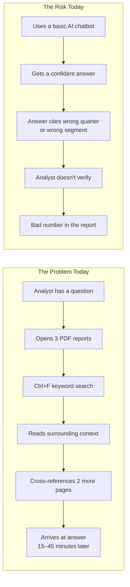
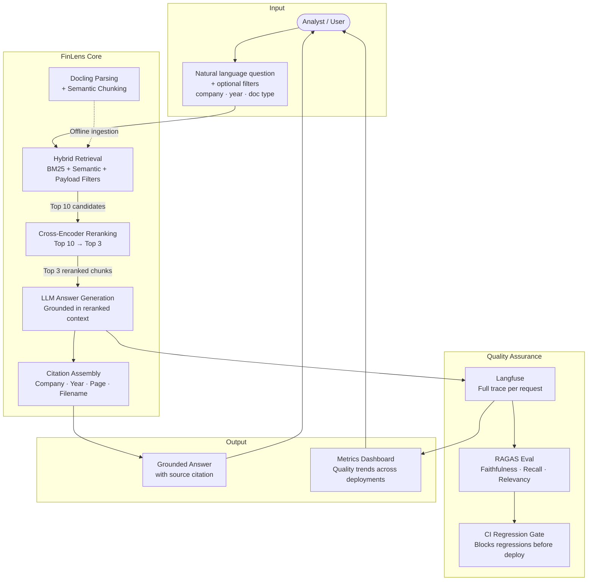
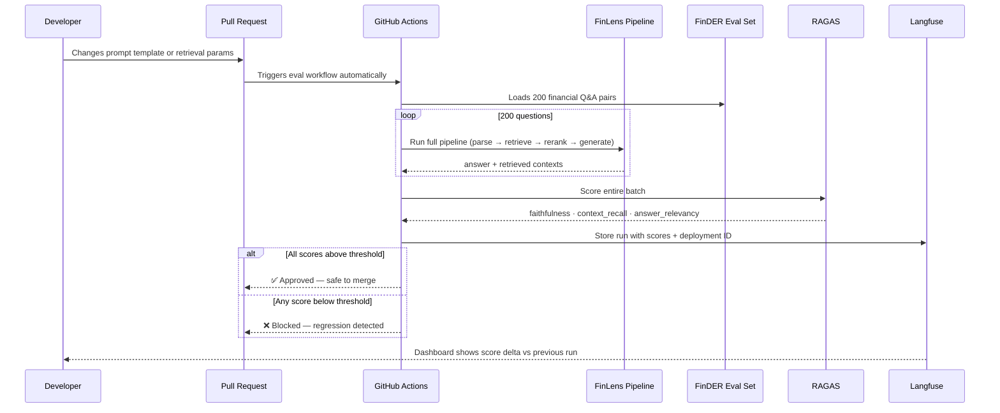

# FINLENS — Project Context File

> **FinLens** — Because financial insight shouldn't require a magnifying glass.
> A production-grade AI system that reads, understands, and reasons over financial documents
> the way a seasoned analyst would — with full auditability of every answer it gives.

---

## 1. The Name

**FinLens** captures two things at once. *Fin* for financial. *Lens* for the idea of
focusing on exactly the right section of a 200-page annual report and surfacing a precise,
cited answer — rather than returning a vague paragraph-level match. It's also a nod to
the observability layer: every inference is observable, every metric is in focus.

---

## 2. The Problem

### 2.1 What Financial Analysts Actually Deal With

Public companies are required to file detailed financial reports — 10-K annual reports,
10-Q quarterly reports, and earnings releases — with the SEC. A single 10-K from a
large-cap company like Apple or Microsoft can run 80–200 pages. A portfolio analyst
tracking 30 companies across 3 years is staring at potentially **thousands of pages of
dense, semi-structured prose** every earnings cycle.

The information they need is always *in there*. But finding it — cross-referencing
segment revenue from page 47 against a footnote on page 112, while also checking the
comparable figure from last year's filing — is slow, error-prone, and expensive in
human attention.

### 2.2 Why Existing Solutions Fall Short

| Approach | Limitation |
|---|---|
| Manual reading | Doesn't scale. An analyst can only process so many documents. |
| Keyword search | Finds the word, not the answer. No reasoning, no context. |
| Basic RAG chatbots | Arbitrary chunking destroys table structure. Returns semantically close chunks but not the most relevant ones. Prone to hallucination on numerical data. |
| General-purpose LLMs (GPT-4, etc.) | No access to proprietary or recent filings. Can't be grounded in a specific document corpus. Expensive at scale. |
| Bloomberg Terminal / FactSet | Expensive ($25k+/year), closed systems, not programmable, no custom reasoning. |

### 2.3 The Core Gap

The problem isn't that the data doesn't exist. It's that:

1. **Documents are parsed poorly** — standard PDF text extraction destroys the structure
   of financial tables, splits headers from their data, and loses footnote relationships.
   A system that ingests garbage will retrieve garbage.

2. **Chunking is semantically blind** — fixed token-window chunking cuts text at
   arbitrary boundaries. A 512-token chunk might contain half a table, half a paragraph,
   and a sentence from a different section. None of it is coherent context.

3. **Retrieval ranking is approximate** — bi-encoder similarity search encodes query
   and document independently. It cannot reason about relevance in context. The top-ranked
   result is often correct at a topic level but wrong at a precision level.

4. **There is no observability** — when a chatbot gives a wrong answer, you have no
   idea *why*. Was it a parsing failure? A retrieval failure? A hallucination? A bad
   prompt? Without tracing, you're flying blind.

5. **There is no regression safety net** — every time you improve your prompt or tweak
   your retrieval, you might be silently breaking something else. No production financial
   system should ship without a measurable quality gate.



---

## 3. What FinLens Aims to Solve

FinLens is not trying to replace financial analysts. It's trying to eliminate the
retrieval and lookup work so analysts can spend their time on judgment, not page-turning.

### 3.1 Primary Goals

**Goal 1 — Structure-aware document understanding from the ground up**
Before any retrieval happens, every PDF is parsed by Docling — a fully open-source
IBM Research library that understands financial document layout. Tables are extracted
as tables. Headers are tagged as headers. Footnotes are kept in relationship with the
figures they annotate. The ingestion pipeline produces semantically coherent chunks
that reflect the actual structure of the document, not arbitrary token windows.

**Goal 2 — High-precision retrieval via two-stage ranking**
Retrieval combines BM25 (exact keyword match) and semantic search (conceptual
similarity) into a single ranked list using Reciprocal Rank Fusion. This pool of top-10
candidates is then re-ranked by a cross-encoder — a model that reads the query and each
chunk *together* and produces a joint relevance score. The top 3 chunks it selects are
genuinely the most relevant in context, not just the most vectorially similar.

**Goal 3 — Measurable, trustworthy answer quality**
Using automated RAGAS evals against a financial benchmark dataset (FinDER), the system
maintains a live score for faithfulness, context recall, and answer relevancy. If quality
drops, it's caught before deployment — not by a user filing a complaint.

**Goal 4 — Full observability into every inference**
Every query — its retrieved documents, cross-encoder scores, the prompt sent to the LLM,
the response, the latency, and the cost — is traced in Langfuse. Nothing is a black box.

**Goal 5 — A regression-safe development workflow**
Prompt engineering is iterative. Every change to a prompt or retrieval parameter
triggers an automated eval run in CI. A PR that causes a faithfulness regression is
blocked from merging.

### 3.2 What Success Looks Like

| Metric | Target |
|---|---|
| Answer Faithfulness (RAGAS) | ≥ 0.80 on FinDER 200-question eval |
| Context Recall (RAGAS) | ≥ 0.75 |
| Answer Relevancy (RAGAS) | ≥ 0.80 |
| Time-to-answer | < 8 seconds end-to-end |
| Citation accuracy | Company, year, page on every answer |

---

## 4. The Solution: How FinLens Achieves This



### 4.1 Three-Layer Retrieval Architecture

FinLens treats retrieval as a funnel, not a single step. Each layer narrows the
candidate set using a more expensive but more accurate method than the one before.

```mermaid
flowchart LR
    Q[User Query] --> PF

    subgraph Layer 1 — Scope Narrowing
        PF[Payload filter\ncompany · year · doc_type]
        PF --> BM25[BM25\nLexical exact-match\ntop 10]
        PF --> SEM[Semantic Search\nConceptual similarity\ntop 10]
        BM25 --> RRF[Reciprocal Rank Fusion\nMerge + deduplicate]
        SEM --> RRF
        RRF --> C10[10 candidates]
    end

    subgraph Layer 2 — Cross-Encoder Reranking
        C10 --> CE[cross-encoder reads\nquery + chunk jointly]
        CE --> C3[Top 3 reranked chunks]
    end

    subgraph Layer 3 — Generation
        C3 --> LLM[LLM generates\ngrounded answer]
        LLM --> ANS[Answer + citations]
    end
```

**Layer 1 — Scope Narrowing (BM25 + Semantic + RRF):** BM25 catches exact keyword
matches — ticker symbols, fiscal quarter labels, specific dollar figures. Semantic
search catches conceptual matches — "revenue from cloud products" when the document
says "Intelligent Cloud segment net revenue." RRF merges both ranked lists, giving
every candidate a unified score based on its position in each list. This produces 10
strong candidates with zero LLM cost.

**Layer 2 — Cross-Encoder Reranking:** The cross-encoder model
(`cross-encoder/ms-marco-MiniLM-L-6-v2`) reads the query and each of the 10 candidates
together as a single concatenated input. Unlike the bi-encoder which encodes them
independently, the cross-encoder can attend to the relationship between query and
document — catching cases where a chunk is topically relevant but not the answer to
this specific question. It outputs a direct relevance score per pair and selects the
true top 3. The model is ~85MB, runs locally, and costs nothing.

**Layer 3 — Generation:** The LLM receives only the top 3 cross-encoder-selected chunks
as context. This is a small, high-quality, highly relevant context window. The LLM is
instructed to ground its answer strictly in the provided context and cite the source
metadata (company, year, doc_type, page_number) for every factual claim.

### 4.2 Ingestion Pipeline: Why Structure Matters

The ingestion pipeline runs once (offline) and is the foundation everything else depends
on. Most RAG systems use a simple text extractor on PDFs — which loses all structure.
FinLens uses Docling.

```mermaid
flowchart TD
    PDF[Raw PDF\n10-K or 10-Q] --> DL

    subgraph Docling — Structure-Aware Parsing
        DL[Layout detection\nidentifies element types]
        DL --> TB[Tables\nextracted as structured data]
        DL --> HD[Headers + Sections\npreserved with hierarchy]
        DL --> PR[Paragraphs\nwith page numbers]
        DL --> FN[Footnotes\nlinked to source figure]
    end

    TB --> SSP
    HD --> SSP
    PR --> SSP
    FN --> SSP

    subgraph SemanticSplitterNodeParser
        SSP[Embeds consecutive sentences\nwith bge-large-en-v1.5]
        SSP --> SIM[Measures cosine similarity\nbetween adjacent sentences]
        SIM --> SPLIT[Splits where similarity drops\ni.e. at topic transitions]
        SPLIT --> CHUNKS[Semantically coherent chunks\nwith preserved metadata]
    end

    CHUNKS --> QD[Qdrant\nvector index]
    CHUNKS --> BM[BM25\nlexical index]
```

Docling preserves what a standard PDF text extractor destroys: table cell relationships,
section hierarchy, page numbers per element, and footnote provenance. These become
metadata fields on every chunk, enabling both payload filtering and accurate citations.

SemanticSplitterNodeParser then groups Docling's output elements into chunks at natural
topic boundaries detected by embedding similarity — not at arbitrary token counts. A
table and its header stay together. A footnote stays near its figure. The resulting
chunks are the coherent units that retrieval is designed to surface.

### 4.3 LLMOps Observability Loop

This is what makes FinLens a production system, not a prototype.



---

## 5. The Datasets

### 5.1 FinanceBench — The Knowledge Corpus

**Source:** `github.com/patronus-ai/financebench`
**Maintained by:** Patronus AI
**Type:** Real SEC filings (PDFs)

FinanceBench is a curated collection of real, publicly available financial documents from
major US public companies. It was created specifically as a benchmark for financial
question answering and is one of the most well-regarded open-source financial document
datasets available.

**What it contains:**

| Document Type | Description |
|---|---|
| 10-K | Annual report — full year financials, risk factors, MD&A |
| 10-Q | Quarterly report — interim financials, updates to guidance |
| Earnings Release | Press release accompanying quarterly results |

**Coverage:** Approximately 150 documents across companies including Apple, Microsoft,
Amazon, Google, Netflix, Nike, 3M, and others. Multiple years per company allowing
year-over-year comparison queries.

**Why this dataset:**
- Real documents, not synthetic. The formatting challenges (tables, footnotes, multi-column
  layouts, nested sections) are genuine and represent what production financial NLP must handle.
- Covers a domain where precision matters — a wrong number in a financial answer isn't
  a minor error.
- Publicly available. No licensing friction. Reproducible.

**How FinLens uses it:**
Documents are run through Docling for structure-aware parsing, then chunked with
SemanticSplitterNodeParser. Each chunk is embedded with `bge-large-en-v1.5` and stored
in Qdrant with company/year/doc_type/page_number/element_type metadata. The BM25 index
is built over the same chunks and persisted separately. The cross-encoder model is loaded
at backend startup and used only at query time.

---

### 5.2 FinDER — The Evaluation Benchmark

**Source:** `huggingface.co/datasets/Linq-AI-Research/FinDER`
**Maintained by:** Linq AI Research
**Type:** Structured Q&A pairs with ground-truth answers

FinDER (Financial Document Entity Retrieval) is a financial question-answering benchmark
designed to test retrieval and reasoning over financial documents. Each entry contains a
question, the expected answer, and the source context.

**What it contains:**

| Field | Description |
|---|---|
| `question` | Natural language financial question |
| `answer` | Ground-truth answer (often a specific figure or fact) |
| `context` | Source passage from the financial document |

**Why this dataset for evals:**
- Questions are grounded in real financial document text — the same domain as FinanceBench
- Answers are specific and verifiable — suitable for RAGAS faithfulness scoring
- Available on HuggingFace, loadable with one line of code
- 200 questions provides a statistically meaningful regression signal

**How FinLens uses it:**
On every pull request that changes a prompt template or retrieval parameter, GitHub
Actions loads 200 questions from FinDER, runs them through the full pipeline, and scores
the results with RAGAS. The scores are pushed to Langfuse and compared against the
previous deployment's scores. If faithfulness drops below 0.80, the PR is blocked.

---

## 6. System Components Glossary

| Component | What It Is | Why It's Here |
|---|---|---|
| **LlamaIndex** | Python framework for document indexing and retrieval | Owns all document-touching logic — Docling integration, semantic chunking, BM25, Qdrant, RAGAS |
| **LangChain** | Composable LLM pipeline framework (LCEL) | Owns the reasoning flow — chaining retrieval, reranking, and generation steps, async streaming, Langfuse tracing |
| **Docling** | IBM Research PDF parser, Apache 2.0, runs locally | Structure-aware extraction — tables, headers, footnotes, page numbers preserved as typed elements |
| **SemanticSplitterNodeParser** | LlamaIndex chunking strategy | Uses embedding cosine similarity to split at topic boundaries rather than fixed token counts |
| **Qdrant** | Open-source vector database | Stores embeddings + metadata, supports payload filters and hybrid search |
| **bge-large-en-v1.5** | BAAI bi-encoder embedding model, runs locally | Used for both ingestion (chunk embedding) and query-time vectorisation; top open-source financial MTEB score |
| **cross-encoder/ms-marco-MiniLM-L-6-v2** | Sentence-Transformers cross-encoder, ~85MB, runs locally | Reranks top-10 RRF candidates by scoring (query, chunk) pairs jointly — final precision layer before generation |
| **LiteLLM** | Unified LLM client library | Single interface to OpenRouter — model-agnostic, swap models without code changes |
| **OpenRouter** | LLM API gateway | Routes to Mistral, Gemma, and others — uses your existing credit |
| **Langfuse** | LLM observability platform | Traces every request end-to-end with nested spans, stores eval scores, powers dashboard |
| **RAGAS** | RAG evaluation framework | Measures faithfulness, context recall, answer relevancy against FinDER ground truth |
| **FastAPI** | Python web framework | Async backend with Server-Sent Events for token streaming |
| **React + Recharts** | Frontend framework + charting | Chat interface + metrics dashboard + eval history |
| **uv** | Python package manager | Fast, lockfile-based, modern replacement for pip/poetry |
| **Docker Compose** | Container orchestration | Runs all services locally with a single command |
| **GitHub Actions** | CI/CD platform | Triggers RAGAS eval on every prompt-touching PR |
| **BM25** | Probabilistic keyword ranking algorithm | Lexical retrieval to complement semantic search in the RRF merge |
| **RRF** | Reciprocal Rank Fusion | Merges BM25 and semantic ranked lists into a unified candidate pool |

---

## 7. What FinLens Is Not

It is worth being explicit about the boundaries of the project.

**FinLens is not a trading system.** It answers questions about historical filings. It
does not make predictions, generate buy/sell signals, or access real-time market data.

**FinLens is not a general-purpose chatbot.** It is scoped to the FinanceBench corpus.
Questions outside that domain will return low-confidence or empty retrievals.

**FinLens is not a replacement for professional financial advice.** It is a research and
analysis assistance tool. Outputs should be verified against source documents.

**FinLens does not scrape or index proprietary data.** All source documents are publicly
available SEC filings included in the FinanceBench dataset.

---

## 8. The North Star

The guiding principle behind every architectural decision in FinLens is this:

> **Every answer must be traceable back to a source. Every system change must be
> measurable against a quality benchmark. Nothing ships without evidence it hasn't
> regressed.**

This is what distinguishes FinLens from a demo. It is designed to be operated, maintained,
and improved over time — not just built and forgotten.