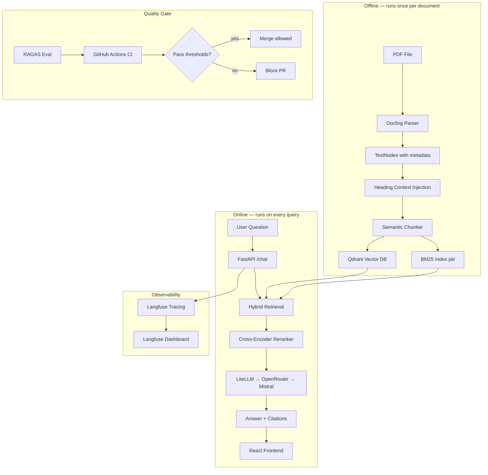
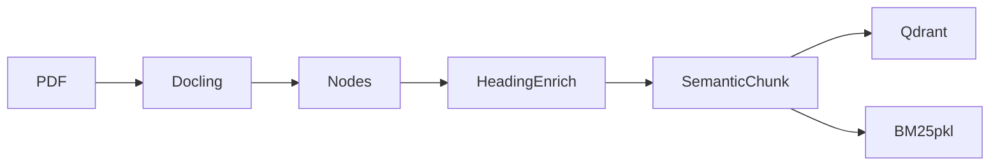
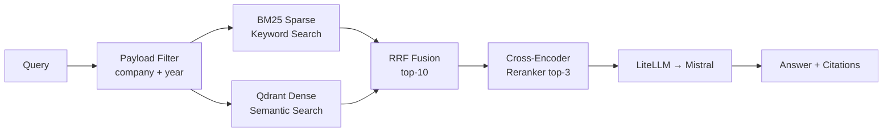
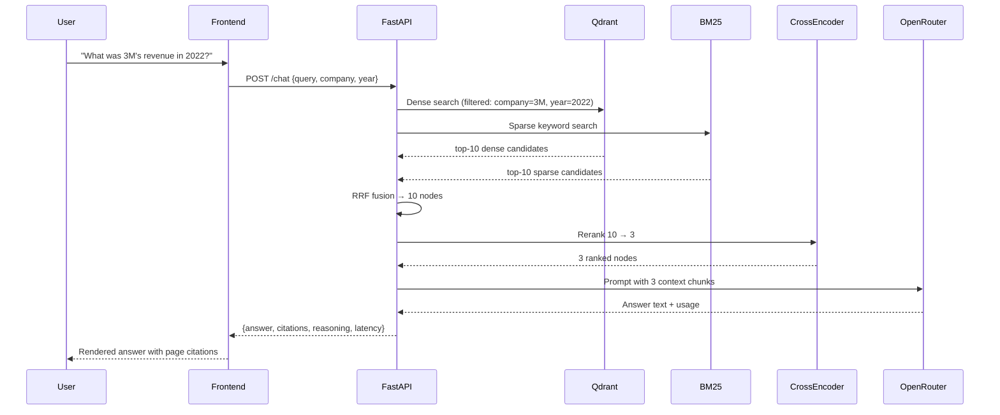

# FinLens — High-Level Overview

> **Learning goal:** Understand what FinLens does, why it was built the way it was, where the design is solid, and where it could be improved. This is the document to read before an interview.

---

## 1. What Is FinLens?

FinLens is a **Retrieval-Augmented Generation (RAG)** system built specifically for financial documents (SEC 10-K filings). The core problem it solves:

> "Given a PDF of a company's annual report, let an analyst ask natural-language questions and get answers backed by exact page citations."

### Why not just use ChatGPT on PDFs?

| Problem | What goes wrong with naive LLM |
|---|---|
| PDFs have complex tables | Text extraction mangles rows/columns |
| Questions span multiple pages | LLM context window can't hold 300 pages |
| Financial numbers must be exact | LLMs hallucinate dollar figures |
| Analysts need audit trails | No traceability to source page |
| Multiple documents (Apple 2021 vs 2022) | No filtering by company/year |

FinLens addresses every one of these with specific architectural decisions.

---

## 2. System Architecture



---

## 3. Two-Phase Pipeline

### Phase 1: Offline Ingestion

This runs **once** when you add a new document. It is expensive (model inference, disk I/O) and does not run on every query.



**Key steps:**
1. **Docling** parses the PDF preserving structure (tables as markdown, headings as separate elements)
2. Each element becomes a `TextNode` with 6 mandatory metadata fields
3. Heading text is **prepended** to following paragraphs (so a chunk knows its section context)
4. Paragraphs are **semantically chunked** — split at topic boundaries, not fixed character counts
5. Two indexes are built: a **dense vector index** (Qdrant) and a **sparse BM25 index** (pickle file)

### Phase 2: Online Query

This runs on every user question. It is designed to be fast.



---

## 4. The Three-Stage Retrieval Funnel

This is the most important architectural decision in the system. Understand this cold.

```
10,000+ chunks in Qdrant
        │
        ▼  Stage 1: Payload filter (company="3M", year=2022)
 ~500 relevant chunks
        │
        ▼  Stage 2: Hybrid BM25 + Dense + RRF  → top_k=10
  10 candidates
        │
        ▼  Stage 3: Cross-encoder rerank        → rerank_top_k=3
   3 final chunks
        │
        ▼
  LLM generation (3 chunks = ~1500 tokens, well within context)
```

**Why three stages?**

- **Stage 1 (filter):** Prevents cross-company/year contamination. A question about "Apple's 2022 revenue" should never pull 3M's 2021 data. Qdrant payload filters do this at the vector DB layer — essentially free.
- **Stage 2 (BM25 + Dense):** Each retriever has blind spots. BM25 is great for exact financial terms ("EPS", "EBITDA"); dense vectors are great for semantic questions ("how did the company perform"). Combining both with RRF is better than either alone.
- **Stage 3 (Cross-encoder):** Bi-encoder retrieval (Qdrant) uses separate embeddings for query and document — it approximates relevance. A cross-encoder sees the query **and** document together, giving much more accurate relevance scores. It's slower (can't pre-compute) but run on only 10 candidates, so it's fast enough.

---

## 5. Tech Stack at a Glance

| Layer | Technology | Why this? | Alternatives / Limitations |
|---|---|---|---|
| PDF parsing | **Docling** | Local, Apache 2.0, structure-aware (preserves tables as markdown) | LlamaParse (cloud, paid), PyMuPDF (no structure), PDFMiner (text only) |
| Node abstractions | **LlamaIndex** | Pre-built TextNode, BM25Retriever, SemanticSplitter primitives | LangChain (similar, heavier), custom (more control) |
| Chunking | **SemanticSplitterNodeParser** | Splits at topic boundaries using embedding similarity | Fixed-size chunks (simpler, but loses topic coherence), recursive splitter |
| Embeddings (ingestion) | **bge-large** (1024-dim) | High-quality, free, MTEB leaderboard performer | OpenAI text-embedding-3 (paid, 1536-dim), gte-modernbert-base (lighter) |
| Embeddings (API) | **gte-modernbert-base** (768-dim) | Lighter, faster for query time | Inconsistency with ingestion embeddings is a **bug** (see §7) |
| Vector DB | **Qdrant** | Local + cloud, payload filters, HNSW, free tier | Pinecone (managed, paid), Weaviate, PGVector |
| Sparse retrieval | **BM25 (pickle)** | Simple, works offline, no extra service | Elasticsearch (scalable but heavy), Qdrant sparse vectors (keeps it in one DB) |
| Reranker | **cross-encoder/ms-marco-MiniLM-L-6-v2** | Free, runs locally, good precision on passage ranking | Cohere Rerank (paid, higher quality), bge-reranker-large (heavier) |
| LLM | **Mistral via OpenRouter** | Free tier, fast, multilingual | GPT-4 (paid), Llama local (requires GPU) |
| LLM abstraction | **LiteLLM** | One API for 100+ models, easy model swapping | Direct OpenAI SDK (less flexible) |
| Observability | **Langfuse** | Open-source, self-hostable, LLM-specific (traces/spans/costs) | LangSmith (LangChain-specific), custom logging |
| Eval | **RAGAS** | Domain-specific RAG metrics (faithfulness, recall, relevancy) | ARES, TruLens, manual eval |
| API | **FastAPI** | Async, typed, auto OpenAPI docs | Flask (sync), Django (heavy) |
| Frontend | **React + Zustand** | Lightweight state, no boilerplate | Redux (verbose), Context API (scales poorly) |
| Package manager | **uv** | 10-100x faster than pip, lockfiles, workspace support | pip, Poetry, conda |

---

## 6. What the System Does Well

### Structure-awareness
Docling preserves table structure as markdown. A naive PDF extractor would turn a financial table into a jumbled string of numbers. FinLens turns it into a proper markdown table that the LLM can parse correctly.

### Heading context injection
When a chunk says "Revenue was 12.3B", it becomes "## Revenue from Operations\nRevenue was $12.3B" after injection. Without this, the chunk is decontextualized — the LLM wouldn't know what "revenue" refers to. This is a small but impactful technique.

### Citation integrity
Every node carries `company`, `year`, `doc_type`, `page_number`, `filename`, `element_type`. These are asserted at every stage (parse → chunk → index). The LLM response always maps citations back to specific page numbers.

### Eval-driven development
RAGAS thresholds gate CI. You can't merge a prompt change that drops faithfulness below 0.80. This is production engineering thinking, not just a demo.

### Reasoning transparency
The `/chat` endpoint returns a full `reasoning` payload showing: how many candidates were retrieved, how many survived reranking, which model was used, cost in USD, latency. The frontend renders this — users can see **why** they got an answer.

---

## 7. Known Weaknesses & Better Approaches

### Embedding model mismatch ⚠️
**Problem:** `embed.py` (used at query time in the API) loads `gte-modernbert-base` (768-dim), but `index.py` (used at ingestion time) uses `bge-large` (1024-dim). These are **different embedding spaces**. Querying a `bge-large`-indexed Qdrant collection with `gte-modernbert-base` vectors will produce wrong similarity scores.

**Fix:** Use the same model at both ingestion and query time. Pick one and set it via environment variable.

### BM25 as a pickle file ⚠️
**Problem:** The BM25 index is serialized as a Python pickle file. This means: it can't be queried across processes easily, it's not a service, and if the BM25 file is lost/corrupted the sparse retrieval silently degrades.

**Better approach:** Use Qdrant's built-in sparse vector support (they support SPLADE/BM25 native now). This keeps both indexes in one service, enables filtering on sparse retrieval too, and removes the file management overhead.

### Sequential chunking
**Problem:** `run_ingestion.py` runs PDF parsing in parallel (ProcessPoolExecutor) but chunking sequentially. SemanticSplitter calls the embedding model per node — this is the bottleneck.

**Fix:** Parallelize chunking or run it on a GPU.

### No streaming
**Problem:** The `/chat` endpoint returns the full answer in one response. For long answers, the user stares at a spinner for several seconds.

**Fix:** Use FastAPI's `StreamingResponse` with LiteLLM streaming to stream tokens as they arrive.

### Single-document ingestion assumption
The ingestion pipeline is designed around one collection (`finlens`). If you want to support different user collections or document sets, the architecture needs tenant isolation.

### Frontend polling for health
**Problem:** `Sidebar.tsx` polls `/status/services` every 10 seconds with `setInterval`. This is fine at small scale but doesn't stop polling when the tab is hidden.

**Fix:** Use `visibilitychange` event to pause polling when the tab is not visible, or use WebSockets.

---

## 8. Data Flow Summary



---

## 9. Evaluation Strategy

FinLens uses **RAGAS** (Retrieval-Augmented Generation Assessment) — a framework that measures RAG quality without human labels:

| Metric | What it measures | Threshold | How it works |
|---|---|---|---|
| **Faithfulness** | Is the answer grounded in the retrieved context? | ≥ 0.80 | LLM checks if each answer claim can be inferred from context |
| **Context Recall** | Did retrieval surface the right chunks? | ≥ 0.75 | Compares retrieved context to ground-truth answer |
| **Answer Relevancy** | Does the answer actually address the question? | ≥ 0.80 | Generates reverse questions from answer, measures similarity to original |

These run in GitHub Actions on every PR that touches prompt or retrieval code.

**Limitation:** RAGAS metrics themselves use an LLM judge — they can be gamed by a verbose answer that "sounds" faithful. They're a proxy, not ground truth.

---

## 10. Deployment Model

```
┌────────────────────┐    ┌──────────────────┐    ┌─────────────────┐
│   Vercel (free)    │    │  Render (free)   │    │  Qdrant Cloud   │
│   React frontend   │───▶│  FastAPI backend │───▶│  (1GB free tier)│
└────────────────────┘    └──────────────────┘    └─────────────────┘
                                   │
                           ┌───────▼────────┐
                           │ Langfuse Cloud │
                           │ (50k traces/mo)│
                           └────────────────┘
```

All services have free tiers. The system is designed to run at zero cost for a portfolio/demo.
