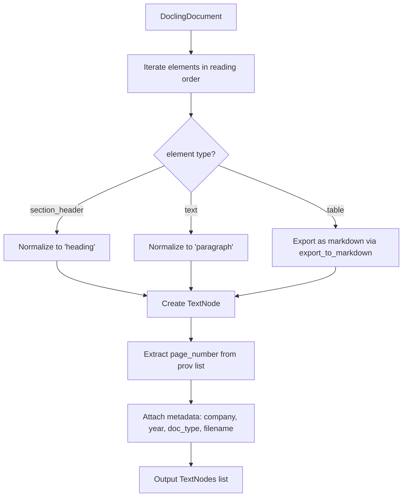
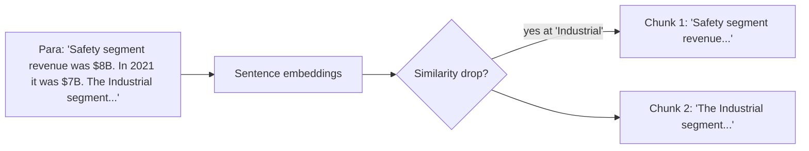
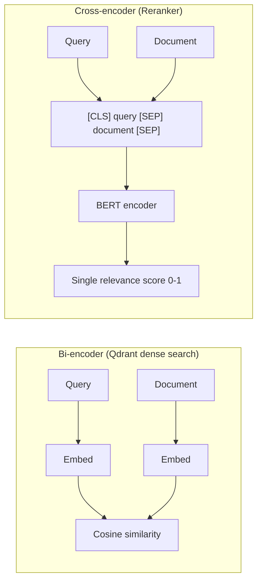
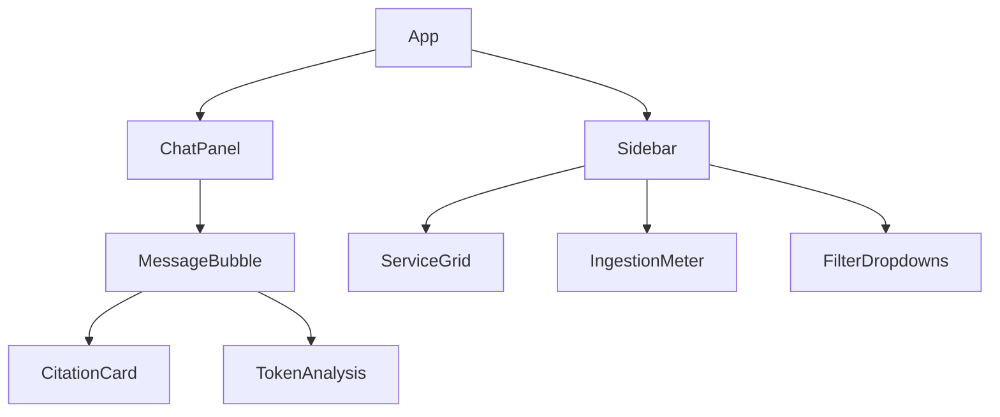

# FinLens — Low-Level Deep Dive

> **Learning goal:** Understand exactly what each module does, what data structures flow between them, what code patterns are used, and where bugs or design gaps exist. Read this after the high-level overview.

---

## 1. The `TextNode` — The Core Data Structure

Every piece of information that flows through FinLens is a `TextNode` (from LlamaIndex). Think of it as a row in a database — it carries text + metadata.

```python
# What a TextNode looks like (conceptually)
TextNode(
    text="Revenue from product sales was $12.3 billion...",
    metadata={
        "element_type": "paragraph",   # or "table", "heading"
        "page_number": 42,
        "filename": "3M_2022_10K_10.pdf",
        "company": "3M",
        "year": "2022",
        "doc_type": "10-K",
    }
)
```

### Why 6 mandatory fields?

These fields serve two purposes:
1. **Filtering** — Qdrant payload filters use `company` and `year` to scope retrieval
2. **Citations** — The final answer cites `company`, `year`, `doc_type`, `page_number`, `filename`

The system asserts these fields are non-`None` at every pipeline stage. If any field is missing, ingestion fails loudly — better than silently broken citations.

---

## 2. `backend/ingestion/parse.py` — PDF → TextNodes

### What Docling does

Docling is a PDF parsing library from IBM Research. Unlike simple text extractors, it understands **document structure**:
- It classifies each element: `text`, `section_header`, `table`, `figure`, `list_item`
- It preserves reading order (not just PDF text stream order)
- Tables are exported as **markdown** (not flattened text)

### `doc_to_nodes()` — the core function



**Key detail — page number extraction:**
```python
# The actual Docling field is .page (not .page_no — that was a bug)
page_number = item.prov[0].page if item.prov else None
```
`prov` is the "provenance" list — it tells you where in the physical PDF this element came from. Each prov entry has a `.page` attribute.

**Table handling:**
Tables are exported via `table_item.export_to_markdown()` — this produces a proper `|col1|col2|` markdown table. The LLM can then parse this as a table. Without this, "revenue" and "12.3" might appear as disconnected tokens.

### `inject_heading_context()` — section awareness

```python
# Before injection:
Node(text="Revenue was $12.3B", metadata={"element_type": "paragraph"})

# After injection (heading before this paragraph was "Revenue from Operations"):
Node(text="## Revenue from Operations\nRevenue was $12.3B", metadata={"element_type": "paragraph"})
```

The heading nodes themselves are **dropped** after injection (they'd just be noise for retrieval). Only paragraph and table nodes survive with their heading prepended.

**Why this matters for retrieval:** When a user asks "what was revenue?", the chunk "Revenue was $12.3B" has poor context. The enriched chunk "## Revenue from Operations\nRevenue was $12.3B" will score higher in both BM25 (contains "revenue") and semantic search (richer context).

---

## 3. `backend/ingestion/chunk.py` — Semantic Chunking

### The problem with fixed-size chunking

```
# Fixed-size (naive, 512 tokens):
Chunk 1: "...The company operates in three segments: Safety..."
Chunk 2: "...Industrial and Transportation. Revenue from Safety..."
# Chunk 2 starts mid-sentence — loses context
```

### SemanticSplitterNodeParser

This LlamaIndex parser uses **embedding similarity** to find where topics change:
1. Compute embeddings for each sentence
2. Find sentence pairs where cosine similarity drops sharply (topic boundary)
3. Split there



**What passes through unchanged:**
- Tables: tables are kept as single nodes (splitting a table destroys its structure)
- Headings: already dropped by `inject_heading_context`

**What gets chunked:**
- Only `element_type == "paragraph"` nodes

### Metadata preservation assertion

After chunking, `_assert_chunk_metadata()` verifies every output chunk still has all 6 required fields. If SemanticSplitter were to create new nodes without copying metadata, this would catch it immediately.

---

## 4. `backend/ingestion/index.py` — Building the Indexes

### Qdrant index setup

```python
# HNSW configuration (from index.py)
VectorParams(
    size=1024,            # bge-large embedding dimension
    distance=Distance.COSINE,
    hnsw_config=HnswConfigDiff(m=16, ef_construct=200)
)
```

**HNSW** (Hierarchical Navigable Small Worlds) — this is the ANN (Approximate Nearest Neighbor) algorithm Qdrant uses. Key parameters:
- `m=16` — number of bidirectional links per node in the graph. Higher = more accurate, more RAM.
- `ef_construct=200` — beam width during index construction. Higher = better index quality, slower build.

These are reasonable defaults. For production with millions of chunks you'd tune them.

**Batched upsert:**
```python
# Nodes are upserted in batches of 100 to avoid memory spikes
for i in range(0, len(points), 100):
    client.upsert(collection_name=..., points=points[i:i+100])
```

### BM25 index

```python
# BM25Retriever from LlamaIndex wraps rank_bm25 library
retriever = BM25Retriever.from_defaults(nodes=nodes, similarity_top_k=10)
# Pickled to disk
with open("data/bm25_index.pkl", "wb") as f:
    pickle.dump(retriever, f)
```

**BM25 algorithm:** Term Frequency × Inverse Document Frequency with saturation. Works on exact token matches. Great for rare financial terms ("EBITDA", specific ticker symbols) that semantic embeddings might conflate with similar-meaning words.

**Weakness of the pickle approach:** The BM25 index must be loaded into memory entirely. With 10,000+ nodes this is still manageable (~100MB), but it's not queryable across processes without passing the object around, and there's no way to update it incrementally — you must rebuild the whole thing when new documents are added.

---

## 5. `backend/retrieval/hybrid.py` — Hybrid Retrieval + RRF

### Reciprocal Rank Fusion

RRF is a simple, parameter-free way to merge ranked lists:

```
RRF score = Σ  1 / (k + rank_i)
```

Where `k=60` (a constant that reduces the impact of rank differences) and `rank_i` is the position of a document in each ranked list.

**Example:**
```
BM25 results:   [DocA(1st), DocB(2nd), DocC(3rd)]
Dense results:  [DocB(1st), DocD(2nd), DocA(3rd)]

RRF scores:
  DocA = 1/(60+1) + 1/(60+3) = 0.01639 + 0.01563 = 0.03202
  DocB = 1/(60+2) + 1/(60+1) = 0.01613 + 0.01639 = 0.03252  ← wins
  DocC = 1/(60+3) + 0         = 0.01563
  DocD = 0         + 1/(60+2) = 0.01613

Final ranking: [DocB, DocA, DocD, DocC]
```

**Why not just average scores?** BM25 scores and cosine similarities are on completely different scales — you can't add them meaningfully. RRF only uses ranks (ordinal), so it's scale-invariant.

### Payload filtering

```python
# Company and year filters applied to Qdrant dense retrieval
filters = Filter(must=[
    FieldCondition(key="company", match=MatchValue(value=company)),
    FieldCondition(key="year",    match=MatchValue(value=year)),
])
```

**Important:** These filters only apply to the Qdrant (dense) retrieval. The BM25 retriever **does not filter** — it searches across all indexed nodes. This means hybrid retrieval can still surface off-company results from BM25.

**This is a bug/limitation.** The cross-encoder reranker partially compensates (irrelevant company results will score poorly), but it's architecturally incorrect. Better: filter BM25 results by metadata after retrieval.

---

## 6. `backend/retrieval/rerank.py` — Cross-Encoder Reranking

### Bi-encoder vs Cross-encoder



The cross-encoder sees both query and document at once — it can model their interaction (e.g., "in this sentence, 'revenue' refers to product sales, not service revenue"). The bi-encoder cannot because embeddings are computed independently.

**Model used:** `cross-encoder/ms-marco-MiniLM-L-6-v2`
- Trained on MS MARCO passage ranking dataset (1M+ query-passage pairs)
- "MiniLM" — distilled, small (6 layers), runs fast on CPU
- Not financial-domain fine-tuned — a limitation

**Lazy loading:**
```python
_reranker: CrossEncoder | None = None

def _get_reranker() -> CrossEncoder:
    global _reranker
    if _reranker is None:
        _reranker = CrossEncoder("cross-encoder/ms-marco-MiniLM-L-6-v2")
    return _reranker
```
The model is downloaded and loaded on first call, then cached. This avoids paying the startup cost on every request.

---

## 7. `backend/generation/generate.py` — LLM Generation

### LiteLLM

LiteLLM is a proxy library that translates any LLM provider's API into OpenAI format:

```python
response = litellm.completion(
    model="openrouter/stepfun/step-3.5-flash:free",
    messages=messages,
    api_base="https://openrouter.ai/api/v1",
    api_key=os.getenv("OPENROUTER_API_KEY"),
)
```

If you want to swap to GPT-4, you'd change `model="openai/gpt-4"` and set `OPENAI_API_KEY`. No other code changes needed.

### Citation assembly

```python
citations = []
for i, node in enumerate(nodes):
    citations.append({
        "index": i + 1,
        "company": node.metadata.get("company", "?"),
        "year": node.metadata.get("year", "?"),
        "doc_type": node.metadata.get("doc_type", "?"),
        "page_number": node.metadata.get("page_number"),
        "filename": node.metadata.get("filename", "?"),
        "excerpt": node.text[:200],  # first 200 chars as preview
    })
```

The LLM is instructed (in the system prompt) to reference citations as `[1]`, `[2]`, etc. The citation index maps back to this list.

### The system prompt strategy

From `generation/prompt.py`:

```
SYSTEM_PROMPT instructs the model to:
1. Answer ONLY from provided context
2. If insufficient context, say so (don't hallucinate)
3. Cite every factual claim with [N] notation
4. Quote numbers exactly — no rounding or paraphrasing
```

This is a **strict grounding prompt**. It trades creativity for accuracy, which is appropriate for financial data.

**Limitation:** The prompt does not handle multi-step reasoning. If answering "what was the YoY growth?" requires knowing both 2021 and 2022 revenue, both must be in the retrieved chunks. If only one year is retrieved, the model will either compute it wrong or refuse.

---

## 8. `backend/api/main.py` — FastAPI Endpoints

### Endpoint inventory

| Method | Path | Purpose |
|---|---|---|
| `POST` | `/chat` | Main RAG query |
| `GET` | `/health` | Liveness check |
| `GET` | `/status/ingestion` | How many docs indexed |
| `GET` | `/status/services` | Qdrant + Langfuse connectivity |
| `GET` | `/models/free` | List of free OpenRouter models |

### The `/chat` request/response contract

```python
# Request
class ChatRequest(BaseModel):
    query: str
    company: str | None = None
    year: str | None = None
    model: str | None = None
    top_k: int = 10
    rerank_top_k: int = 3

# Response
class ChatResponse(BaseModel):
    answer: str
    citations: list[Citation]
    usage: TokenUsage
    latency_ms: float
    trace_id: str | None
    reasoning: ReasoningPayload
```

### Reasoning payload

This is a transparency feature — the API exposes the entire pipeline's internals:

```python
ReasoningPayload = {
    "summary": "FinLens answered using 3 sources from 3M 2022 10-K",
    "retrieval": {
        "strategy": "hybrid_bm25_dense_rrf",
        "top_k": 10,
        "filters": {"company": "3M", "year": "2022"},
        "candidates_found": 10,
    },
    "reranking": {
        "model": "cross-encoder/ms-marco-MiniLM-L-6-v2",
        "selected_nodes": 3,
    },
    "generation": {
        "model": "openrouter/stepfun/step-3.5-flash:free",
        "cost_usd": 0.000012,
        "latency_ms": 1240,
    },
    "top_sources": ["3M_2022_10K_10.pdf p.42", ...]
}
```

### 404 on no results

```python
if not nodes:
    raise HTTPException(status_code=404, detail="No relevant context found")
```

Rather than hallucinating an answer when retrieval returns nothing, the API returns 404. This is the right choice for a financial application — a wrong answer is worse than no answer.

### CORS configuration

```python
app.add_middleware(
    CORSMiddleware,
    allow_origins=["*"],  # all origins allowed
    ...
)
```

`allow_origins=["*"]` is fine for a demo/portfolio project but is a security risk in production. You'd set this to your specific frontend domain.

---

## 9. `backend/observability/tracing.py` — Langfuse

### What Langfuse gives you

Langfuse is an open-source LLM observability platform. Every query through FinLens creates:

```
Trace: "chat query: what was 3M's revenue?"
  ├── Span: "hybrid_retrieve" (latency: 45ms, input: query+filters)
  ├── Span: "rerank" (latency: 120ms, input: 10 nodes, output: 3 nodes)
  └── Span: "generate" (latency: 1200ms, model: mistral, tokens: 850, cost: $0.00001)
```

You can then:
- See which queries are slowest
- Track cost per query over time
- Compare before/after prompt changes
- Debug why a specific query returned wrong results

### Implementation pattern

```python
# Lazy initialization — Langfuse client not created until first use
_langfuse: Langfuse | None = None

def _get_client() -> Langfuse:
    global _langfuse
    if _langfuse is None:
        _langfuse = Langfuse(
            public_key=os.getenv("LANGFUSE_PUBLIC_KEY"),
            secret_key=os.getenv("LANGFUSE_SECRET_KEY"),
            host=os.getenv("LANGFUSE_HOST", "http://localhost:3000"),
        )
    return _langfuse
```

All functions degrade gracefully — if Langfuse is unreachable, tracing just doesn't happen. The main pipeline doesn't fail.

---

## 10. `eval/ragas_eval.py` — Quality Gates

### How RAGAS metrics work

**Faithfulness:**
```
For each sentence in the answer:
  → Ask LLM: "Can this be inferred from the context?"
Faithfulness = (sentences verifiable from context) / (total sentences)
```

**Context Recall:**
```
For each sentence in the ground-truth answer:
  → Ask LLM: "Is this information present in the retrieved context?"
Recall = (ground-truth sentences covered) / (total ground-truth sentences)
```

**Answer Relevancy:**
```
Generate N questions from the answer text
Measure cosine similarity between generated questions and original query
High similarity → answer is on-topic
```

### The CI integration

```yaml
# .github/workflows/ragas.yml (inferred)
- run: uv run python eval/ragas_eval.py --sample 20
- if score < threshold: exit(1)  # blocks PR merge
```

### Limitation

RAGAS uses an LLM judge internally (usually GPT-3.5/4). This means:
- Evaluation costs money
- Evaluation has its own error rate
- A model could score high on RAGAS but still give wrong financial numbers (RAGAS doesn't verify arithmetic)

For financial applications, you'd want to supplement RAGAS with **exact-match tests** on known numerical questions.

---

## 11. `backend/tests/` — Test Architecture

```
tests/
  conftest.py              ← shared fixtures
  test_pipeline.py         ← end-to-end parse+chunk+index test
  unit/
    test_parse.py          ← doc_to_nodes, inject_heading_context
    test_chunk.py          ← split_paragraph_nodes
    test_prompt.py         ← build_prompt formatting
    test_rerank.py         ← cross-encoder ordering (mocked)
    test_hybrid_fusion.py  ← RRF algorithm correctness
    test_reasoning_payload.py ← _build_reasoning structure
    test_openrouter_models.py ← model list filtering
  integration/
    test_api.py            ← FastAPI endpoints (requires running services)
    test_setup_collection.py ← Qdrant idempotency
    test_bm25_build_and_load.py
    test_hybrid_retrieval.py
    test_ingestion_to_qdrant.py
  live/
    test_openrouter_generation.py ← real LLM call (needs API key)
    test_full_rag_query.py        ← full pipeline (needs seeded Qdrant)
```

### Key test patterns

**Fixture: fake embedding model**
```python
# conftest.py — applied to ALL tests via autouse=True
@pytest.fixture(autouse=True)
def fake_embed_model(monkeypatch):
    monkeypatch.setattr("ingestion.embed.get_embed_model", lambda: _DummyEmbeddingModel())
```
This prevents tests from downloading the 1.5GB bge-large model on every run. The dummy model returns zero vectors — sufficient for testing node structure, not retrieval quality.

**Fixture: sample nodes**
```python
@pytest.fixture
def sample_nodes():
    return [
        TextNode(text="3M net sales 2022...", metadata={...company="3M", year="2022"...}),
        TextNode(text="3M operating income 2023...", metadata={...year="2023"...}),
        TextNode(text="Adobe revenue 2022...", metadata={...company="Adobe"...}),
    ]
```
Reused across unit and integration tests for consistency.

**Mock cross-encoder:**
```python
# test_rerank.py
monkeypatch.setattr(rerank, "_get_reranker", lambda: mock_encoder)
mock_encoder.predict.return_value = [0.9, 0.1, 0.5]
# Test verifies node ordering matches scores: [0.9, 0.5, 0.1]
```

---

## 12. Frontend Architecture

### State management: Zustand

Zustand is a minimal React state library. No reducers, no actions — just a store object with setters:

```typescript
// useAppStore.ts (simplified)
interface AppStore {
  messages: Message[];
  isLoading: boolean;
  company: string;
  year: string;
  selectedModel: string;
  addMessage: (msg: Message) => void;
  setLoading: (v: boolean) => void;
}

const useAppStore = create<AppStore>((set) => ({
  messages: [],
  isLoading: false,
  company: "",
  year: "",
  selectedModel: "openrouter/stepfun/step-3.5-flash:free",
  addMessage: (msg) => set((state) => ({ messages: [...state.messages, msg] })),
  setLoading: (v) => set({ isLoading: v }),
}));
```

**Why Zustand over Redux?**
- Redux requires actions + reducers + selectors for every state change — lots of boilerplate
- Zustand is 1KB and lets you write direct mutations
- For a single-page chat app, Zustand is the right level of complexity

### API client: Axios + typed responses

```typescript
// client.ts
export async function postChat(req: ChatRequest): Promise<ChatResponse> {
    const res = await axios.post<ChatResponse>(`${BASE_URL}/chat`, req);
    return res.data;
}
```

The TypeScript types in `useAppStore.ts` mirror the Pydantic models in `main.py`. If the API changes, TypeScript will catch mismatches at compile time.

**Current gap:** There's no OpenAPI codegen (e.g., `openapi-typescript`). The types are manually kept in sync, which is a maintenance burden.

### Component breakdown



**ChatPanel** — handles input, sends POST /chat, adds messages to store
**MessageBubble** — renders user/assistant messages; assistant messages show expandable reasoning payload
**Sidebar** — polls health/status every 10s; loads free models on mount

---

## 13. Docker Compose Services

```yaml
services:
  backend:   FastAPI, port 8000, depends_on: qdrant, langfuse
  frontend:  React dev server, port 5173, depends_on: backend
  qdrant:    Vector DB, port 6333, volume: qdrant_storage
  postgres:  DB for Langfuse, volume: postgres_data
  langfuse:  LLM observability UI, port 3000, depends_on: postgres
```

**All 5 services must be running for the full system to work.** The backend has health checks for both Qdrant and Langfuse; if they're unreachable, `/status/services` will show degraded state.

**Note on frontend in Docker:** The frontend service runs the React dev server (`vite`) inside Docker. In production you'd build static assets and serve them from Nginx or Vercel — running the dev server in production is a bad practice (hot-reload, no minification, dev error messages).

---

## 14. Key Interview Questions & Answers

**Q: Why use Docling over PyMuPDF or pdfminer?**
A: Docling understands document structure — it classifies elements as tables/headings/paragraphs and exports tables as markdown. PyMuPDF and pdfminer extract raw text without structural understanding, which mangles financial tables.

**Q: What is RRF and why use it over score averaging?**
A: Reciprocal Rank Fusion merges ranked lists using `1/(k+rank)`. BM25 and cosine similarity scores are on different scales so you can't average them. RRF uses only ordinal rank information, making it scale-invariant.

**Q: Why have a cross-encoder if you already have semantic search?**
A: Semantic search uses bi-encoders — query and document are embedded independently and compared by cosine similarity. Cross-encoders see query+document together, enabling richer relevance modeling. But cross-encoders can't be pre-computed, so they're only run on the top-10 candidates.

**Q: How does heading context injection work and why?**
A: After parsing, for each heading node, its text is prepended to all following paragraph nodes (until the next heading). The heading node is then dropped. This ensures each chunk carries its section context, improving retrieval recall.

**Q: Why does the system assert metadata at every stage?**
A: Citations depend on page_number, company, year, etc. If any metadata is lost during chunking or indexing, citations break silently. Early assertion catches the failure at ingestion time rather than returning garbage citations to users.

**Q: What would you do differently?**
A: (1) Fix the embedding model mismatch between ingestion and query. (2) Move BM25 into Qdrant native sparse vectors to avoid pickle file management and enable BM25 filtering. (3) Add streaming to the /chat endpoint. (4) Fine-tune the cross-encoder on financial domain data. (5) Add exact-match numerical tests alongside RAGAS.

**Q: How does RAGAS measure faithfulness?**
A: It uses an LLM judge that, for each sentence in the generated answer, asks "can this be inferred from the retrieved context?". Faithfulness = verifiable sentences / total sentences.

**Q: What is SemanticSplitter and how does it differ from fixed-size chunking?**
A: SemanticSplitter computes embeddings for each sentence, then finds places where consecutive sentence similarity drops sharply (topic boundaries) and splits there. Fixed-size chunking splits at character/token count without regard for semantic coherence, often cutting mid-sentence or mid-topic.
