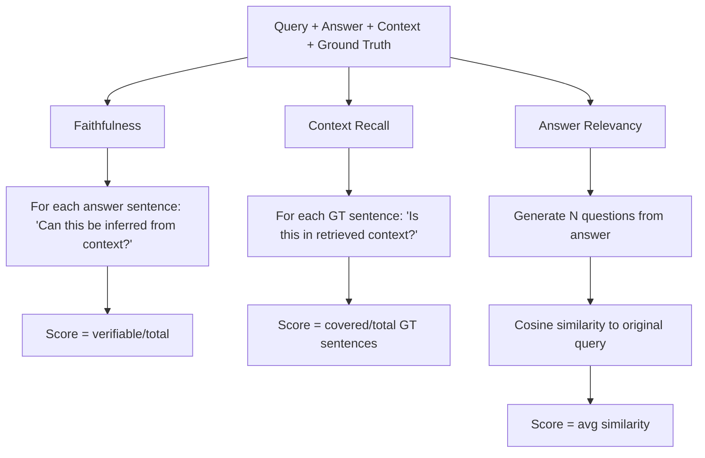

# FinLens — Tech Decisions, Tradeoffs & Enhancements

> **Learning goal:** For every major technical choice in FinLens, understand *why* it was made, what the real tradeoffs are, and what a production-grade alternative would look like. This is the most interview-valuable document.

---

## 1. PDF Parsing: Docling

### Decision
Use Docling (IBM Research) instead of cloud-based parsers.

### Why Docling
| Criterion | Docling | LlamaParse (cloud) | PyMuPDF |
|---|---|---|---|
| Table structure | ✅ Markdown export | ✅ (paid) | ❌ Raw text |
| Cost | Free | $0.003/page | Free |
| Privacy | Local | Sends PDFs to cloud | Local |
| License | Apache 2.0 | Proprietary | AGPL |
| Speed | Medium | Fast (API) | Very fast |
| Accuracy on complex layouts | High | High | Medium |

### Real tradeoff
Docling is slower than raw text extraction and requires more setup. For a portfolio project, this tradeoff is fine. For production with thousands of PDFs per day, you'd benchmark Docling's processing time and potentially parallelize across machines or use cloud parsing with proper data governance sign-off.

### Enhancement
**Azure Document Intelligence** (formerly Form Recognizer) achieves near-Docling quality at scale and is SOC2 compliant — important for enterprise financial data. It's the cloud answer to Docling.

---

## 2. Chunking: Semantic vs Fixed-Size

### Decision
Use `SemanticSplitterNodeParser` instead of `SentenceSplitter` with fixed token counts.

### The actual tradeoff

```
Fixed-size (512 tokens):
  + Predictable: every chunk is roughly the same size
  + Fast: no embedding inference during chunking
  - Blind to topic boundaries: splits mid-argument
  - Requires overlap parameter to avoid boundary effects

Semantic:
  + Splits at topic boundaries: each chunk is self-contained
  - Slower: runs embedding inference per sentence
  - Variable chunk sizes: some chunks may be very large or very small
  - Hyperparameter: how sharp must the similarity drop be?
```

### What FinLens actually does
Non-paragraph elements (tables, etc.) pass through unchunked. Only paragraphs are semantically split. This is smart — splitting a financial table destroys its structure.

### Enhancement
**Late chunking** (a newer technique): embed the full document, then chunk post-embedding. This preserves document-level context in each chunk embedding. Libraries like `chonkie` implement this. Would likely improve retrieval recall for questions spanning multiple paragraphs.

---

## 3. Embedding Model: bge-large vs gte-modernbert

### Decision (with a bug)
The codebase uses **two different embedding models**:
- `index.py` (ingestion): `bge-large-en-v1.5` (1024-dim)
- `embed.py` (query time): `gte-modernbert-base` (768-dim)

### Why this is a problem
Embeddings are only comparable within the same vector space. A 768-dim gte vector and a 1024-dim bge vector are mathematically incompatible — you can't compute cosine similarity between them. Querying a bge-indexed Qdrant collection with gte vectors will produce meaningless similarity scores.

### What likely happened
During development, the API-side embedding was swapped to `gte-modernbert-base` (lighter, faster for query time) without updating the ingestion side. The fix is to pick one model and use it everywhere.

### Production decision framework
| Model | Dims | MTEB Score | Speed | Use case |
|---|---|---|---|---|
| `bge-large-en-v1.5` | 1024 | 64.2 | Slow | High-accuracy offline indexing |
| `gte-modernbert-base` | 768 | 62.4 | Fast | Query-time if latency matters |
| `text-embedding-3-small` | 1536 | 62.3 | API | If you don't want to host models |

**Best practice:** Use the same model for both. If you want a faster query-time model, build a separate index with that model.

---

## 4. Vector Database: Qdrant

### Decision
Use Qdrant over Pinecone, Weaviate, or pgvector.

### Why Qdrant
| Criterion | Qdrant | Pinecone | Weaviate | pgvector |
|---|---|---|---|---|
| Self-hostable | ✅ | ❌ (cloud only) | ✅ | ✅ |
| Free tier cloud | ✅ (1GB) | ✅ (limited) | ✅ | N/A |
| Payload filters | ✅ Native | ✅ | ✅ | SQL WHERE |
| Sparse vectors | ✅ Native (v1.7+) | ✅ | ❌ | ❌ |
| License | Apache 2.0 | Proprietary | BSD | PostgreSQL |

### HNSW parameters in context
```python
HnswConfigDiff(m=16, ef_construct=200)
```
- `m=16`: Each node connects to 16 neighbors. The literature suggests 16 for moderate datasets. Lower = faster indexing, lower recall. Higher = slower, higher recall.
- `ef_construct=200`: Beam width during index build. 100-400 is typical. Higher = more accurate index, slower to build.

### Enhancement
The BM25 pickle approach could be replaced with Qdrant's **native sparse vector support**. Store both dense and sparse vectors per point, enabling unified filtered search across both. This eliminates the BM25 pickle file entirely.

---

## 5. Hybrid Retrieval + RRF

### Decision
BM25 (sparse) + Qdrant dense + Reciprocal Rank Fusion.

### Why hybrid?

```
Question: "What was the net earnings per share?"

BM25: HIGH score (exact term "net earnings per share" → keyword match)
Dense: MEDIUM score (semantically similar, but "EPS" embedding might not align perfectly)

Question: "How did the safety segment perform operationally?"

BM25: LOW score (no exact keyword match on vague question)
Dense: HIGH score (semantic meaning captured)
```

Neither retriever dominates across all question types. Hybrid consistently outperforms either alone on diverse question sets.

### Why RRF and not weighted sum?
BM25 scores are unbounded (can be 0.1 or 15.7). Cosine similarity is bounded [0,1]. You cannot weight-sum them without normalization, and normalization is dataset-dependent. RRF uses only rank ordering — scale-invariant and parameter-free.

### The known bug
Qdrant payload filters apply to dense retrieval. BM25 does not apply filters — it searches all 10,000+ nodes. In a multi-company dataset, BM25 results for "3M revenue" might include Adobe nodes. The cross-encoder will likely demote them, but they still consume candidate slots.

**Fix:** After BM25 retrieval, filter results by `metadata["company"]` and `metadata["year"]` before fusion.

---

## 6. Cross-Encoder Reranking

### Decision
Use `cross-encoder/ms-marco-MiniLM-L-6-v2` as the reranker.

### Why cross-encoder over bi-encoder for reranking?
Bi-encoder similarity is an approximation. Cross-encoders model query-document interaction jointly — this is significantly more accurate but O(n) in inference cost (can't precompute). Running on only 10 candidates makes it fast enough.

### MS MARCO dataset context
MS MARCO is a passage ranking dataset from Microsoft (real Bing search queries + human-judged passages). The cross-encoder is trained on this. Financial questions are a distribution shift — the model hasn't seen questions like "What was 3M's EBITDA margin in Q3 2022?" This is a meaningful limitation.

### Enhancement options
1. **Fine-tune the cross-encoder** on FinanceBench (150 PDFs + 150 Q&A pairs) — likely 5-10pp improvement in precision
2. **Use Cohere Rerank API** — general-purpose, usually better than MiniLM, but $0.002/100 calls
3. **bge-reranker-large** — open-source, better than MiniLM, requires more GPU memory

---

## 7. LLM: Mistral via OpenRouter + LiteLLM

### Decision
Use LiteLLM as abstraction layer, OpenRouter as provider, Mistral as model (free tier).

### LiteLLM's role
LiteLLM translates all LLM providers to OpenAI SDK format:
```python
# Same code, any provider:
litellm.completion(model="openrouter/mistral/...", ...)
litellm.completion(model="anthropic/claude-3-5-sonnet-...", ...)
litellm.completion(model="openai/gpt-4", ...)
```
This means swapping models is a one-line config change. The frontend model selector works because of this abstraction.

### OpenRouter's role
OpenRouter is a model marketplace — it aggregates hundreds of models under one API key. The `:free` suffix indicates zero-cost models (with rate limits). This enables a zero-cost demo.

### Tradeoffs of free models
- Rate limited (typically 200 req/day, 20 req/min)
- No SLA on uptime
- Model weights can be removed

For production: pay for a proper API tier or self-host Mistral 7B with llama.cpp/vLLM.

### Prompt design: strict grounding

The system prompt enforces:
1. **Answer only from context** — prevents hallucination
2. **Cite everything** — enforces traceability
3. **Quote numbers exactly** — no paraphrasing of financial figures
4. **Refuse when insufficient** — returns a clear failure mode

This is the right approach for financial RAG. The tradeoff: the model won't interpolate or reason beyond what's explicitly in the chunks. Multi-step math ("calculate YoY growth") requires both years to be in context.

---

## 8. Observability: Langfuse

### Decision
Use Langfuse instead of custom logging or LangSmith.

### Why Langfuse over alternatives
| Criterion | Langfuse | LangSmith | Custom logging |
|---|---|---|---|
| Self-hostable | ✅ | ❌ | ✅ |
| LLM-aware (tokens, cost, latency) | ✅ | ✅ | Manual |
| Trace hierarchy (spans) | ✅ | ✅ | Manual |
| Cost tracking | ✅ | ✅ | Manual |
| Free tier | 50k traces/mo | Limited | Free |
| LangChain-specific | No | Yes | No |

### What you get in practice
Every `/chat` request creates a Langfuse trace. You can:
- See exact inputs/outputs at each pipeline stage
- Identify slow queries (is it retrieval or generation?)
- Track token cost per query over time
- Compare prompt versions side by side

### Enhancement
Add **user feedback** to traces — allow users to thumbs up/down answers. Langfuse supports this natively. You'd then have a labelled dataset for fine-tuning or RLHF.

---

## 9. Evaluation: RAGAS

### Decision
Use RAGAS framework with thresholds gating CI.

### RAGAS metric internals



### Limitations of RAGAS

1. **LLM judge bias:** RAGAS uses an LLM to judge. Different LLM judges give different scores. GPT-4 judge ≠ GPT-3.5 judge.
2. **Faithfulness ≠ numerical accuracy:** A model can say "revenue was approximately $12 billion" (faithful to context saying $12.3B) and score 1.0 on faithfulness but be wrong for financial analysis purposes.
3. **Requires ground truth:** Context recall requires ground-truth answers. Generating 150 Q&A pairs for FinanceBench is itself a significant effort.
4. **Cost:** Each RAGAS evaluation calls the LLM judge multiple times per question. With 150 test questions, this can cost $5-20 per CI run.

### Enhancement
Supplement RAGAS with:
- **Exact-match tests:** For known questions ("What was 3M's 2022 revenue?"), assert the answer contains "35.4" or "35.4 billion"
- **Unit tests on retrieval:** Assert that for a specific question, a specific page's chunk appears in top-3

---

## 10. Package Management: uv

### Decision
Use `uv` instead of pip, Poetry, or conda.

### Why uv
- `uv sync` installs all deps in ~2 seconds vs ~2 minutes with pip
- Lockfile (`uv.lock`) ensures deterministic installs
- Built-in workspace support (root + backend as separate envs)
- PEP 517/518 compliant, drop-in pip replacement

### The dual-pyproject issue
There are two `pyproject.toml` files:
- `/pyproject.toml` — old, pre-restructure (still present)
- `/backend/pyproject.toml` — current, all actual deps

All commands (`uv sync`, `uv run pytest`) must be run from `backend/`. Running from root will install the wrong/empty dependencies. This is a **developer experience hazard** — a better setup would use uv workspaces to make root-level commands work correctly.

---

## 11. What's Missing for Production

### Things not implemented that a production RAG needs

| Feature | Current state | Production solution |
|---|---|---|
| Auth | No auth | JWT/OAuth on FastAPI |
| Rate limiting | No | FastAPI middleware + Redis |
| Streaming | No | `StreamingResponse` + SSE |
| Multi-tenancy | One Qdrant collection | Collection-per-tenant or metadata namespace |
| Incremental BM25 | Full rebuild on new doc | Migrate to Qdrant sparse vectors |
| GPU inference | CPU only | Deploy cross-encoder on GPU instance |
| Frontend in production | Vite dev server in Docker | Vite build → Nginx or CDN |
| Error monitoring | No | Sentry integration |
| Input validation | Basic Pydantic | Query sanitization, length limits |
| Model consistency | Two embedding models | One model, enforced via env var |

### The one-week enhancement list (priority order)
1. **Fix embedding model mismatch** — critical correctness bug, ~1 hour
2. **Filter BM25 by metadata** — fix cross-company contamination, ~2 hours
3. **Add streaming to /chat** — significant UX improvement, ~4 hours
4. **uv workspaces** — make root-level commands work, ~2 hours
5. **Fine-tune cross-encoder on FinanceBench** — measurable precision gain, ~1 day
