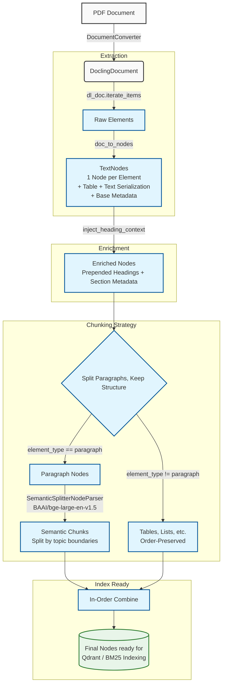

# FinOps Document Processing Pipeline

This document explains the document ingestion and processing pipeline implemented in `main.py`. The pipeline extracts rich structural elements from PDF documents, enriches them with semantic context, and chunks them intelligently for optimal retrieval in a RAG (Retrieval-Augmented Generation) system.

## Dependencies

The pipeline relies on the following core libraries:

1. **Docling (`docling`)**: Used for the initial document ingestion. Unlike traditional PDF parsers that just rip text, Docling uses deep learning models to understand the true layout of the document, identifying tables, paragraphs, lists, and section headers natively.
2. **LlamaIndex (`llama-index-core`)**: The overarching framework used to represent the extracted elements as standardized `TextNode` objects and manage the parsing pipeline.
3. **HuggingFace Embeddings (`llama-index-embeddings-huggingface`)**: Provides the local embedding model (`BAAI/bge-large-en-v1.5`) used strictly during the semantic chunking phase to determine topic boundaries.

*Note: You can run this pipeline using `uv run python main.py`, assuming your `pyproject.toml` and `uv.lock` have these dependencies installed.*

## How It Works (Step-by-Step)

### 1. Document Ingestion (Docling)
The `DocumentConverter` from Docling reads the PDF (e.g., `3M_2022_10K_10.pdf`) and converts it into a `DoclingDocument` (`dl_doc`). This object is an in-memory, structured representation of the entire PDF, where every element (a cell, a row, a paragraph) retains its bounding box, page number, and structural label—much like a spreadsheet rather than a flat markdown text file.

### 2. Element Extraction (`doc_to_nodes`)
Instead of letting an exporter squash the document into a single markdown string, our custom `doc_to_nodes` function iterates over `dl_doc.iterate_items()`. For every structural element, it:
- Normalizes the label (e.g., converting `"text"` to `"paragraph"`, `"section_header"` to `"heading"`).
- Serializes tables through `TableItem.export_to_markdown(doc=dl_doc)` so table content is preserved.
- Wraps the text in a LlamaIndex `TextNode`.
- Injects critical metadata such as `element_type`, `page_number`, `company`, `year`, and `doc_type`. This metadata is essential for downstream filtering in vector databases like Qdrant.

### 3. Context Injection (`inject_heading_context`)
Isolated chunks lose their meaning when separated from their section headers. This step iterates through the sequential nodes in document order, keeping track of the most recently seen `"heading"`. For all subsequent nodes under that heading, it prepends the heading text (e.g., `[Section: Human Capital]\n\n`) and records `section_heading` metadata. This ensures that the vector embedding for that node captures the broader context.

### 4. Node Splitting
Paragraph nodes are split semantically while structured nodes like tables, lists, and captions are preserved as atomic chunks. This strategy keeps the meaning of structured content while still giving prose flexibility to split at topic boundaries.

### 5. Semantic Chunking
The paragraph nodes are passed to the `SemanticSplitterNodeParser`. Instead of statically cutting text every 500 tokens, this parser calculates the cosine similarity between adjacent sentences using the `BAAI/bge-large-en-v1.5` HuggingFace model. It only cuts the chunk when there is a significant drop in similarity, denoting a genuine shift in topic.

### 6. Recombination and Final Output
Paragraph splits are applied in-place within the original reading-order stream. The untouched structural nodes (like intact tables) stay in the same relative position to their surrounding text. The result is a unified list of `TextNode` objects that is metadata-rich and ready for indexing into BM25 or Qdrant.

## Architecture Diagram

